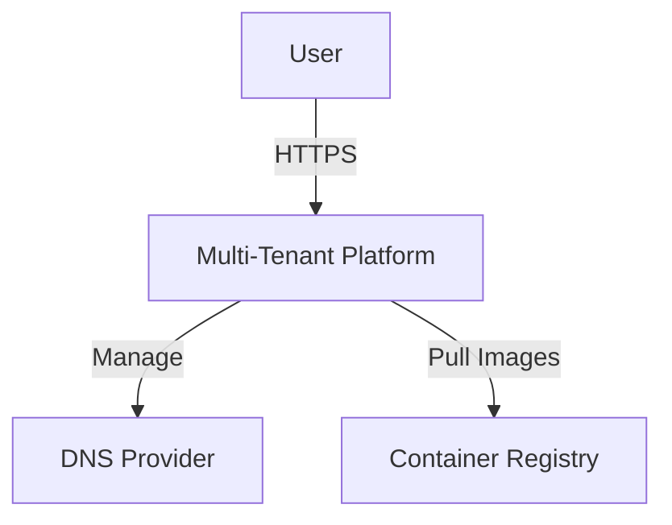
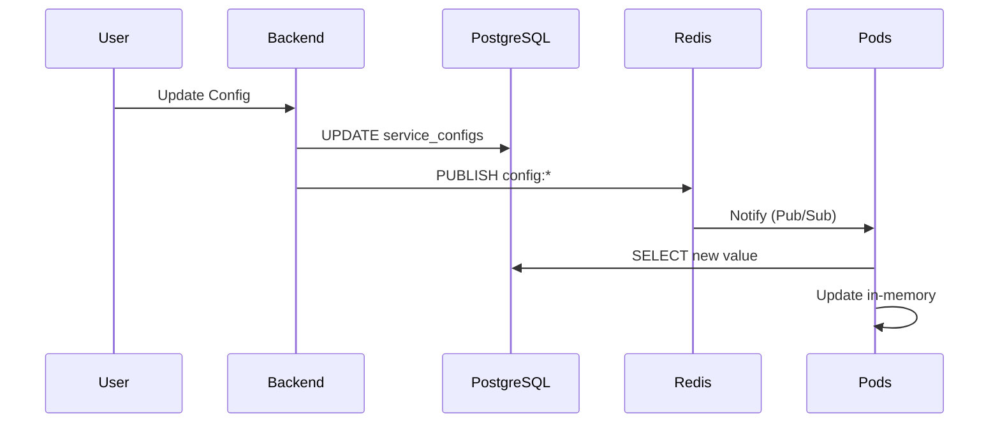

# Architecture Diagrams

> **Last Updated:** 20 October 2025
> **Format:** Mermaid (.mmd files)

## Overview

This directory contains architecture diagrams in Mermaid format. Diagrams are stored as `.mmd` files and can be rendered to images or viewed directly in GitHub/Markdown viewers.

## Available Diagrams

| Diagram | Type | Purpose |
|---------|------|---------|
| `system-context.mmd` | C4 Level 1 | System context (users, external systems) |
| `container-diagram.mmd` | C4 Level 2 | Container/component view |
| `deployment-view.mmd` | Deployment | CI/CD pipeline and deployment flow |
| `data-flow.mmd` | Sequence | End-to-end data flow (Org → Project → Chat) |
| `config-hot-reload.mmd` | Sequence | Config hot-reload mechanism (SQL + Redis) |
| `observability-stack.mmd` | Architecture | Observability stack (Prometheus, Loki, Tempo) |

---

## How to View Diagrams

### In GitHub

GitHub automatically renders Mermaid diagrams in Markdown files.

### In VS Code

Install the **Mermaid Preview** extension:
```bash
code --install-extension bierner.markdown-mermaid
```

### In Browser

Use the [Mermaid Live Editor](https://mermaid.live/).

---

## How to Render to Images

### Using mermaid-cli

```bash
# Install mermaid-cli
npm install -g @mermaid-js/mermaid-cli

# Render single diagram
mmdc -i system-context.mmd -o system-context.png

# Render all diagrams
./tools/scripts/render-diagrams.sh
```

### Output

Rendered images are placed in `docs/architecture/diagrams/*.png` and **excluded from Git** (see `.gitignore`).

---

## Diagram Standards

### Naming Convention

- `{purpose}-{type}.mmd` (e.g., `system-context.mmd`, `config-hot-reload.mmd`)
- Use lowercase with hyphens

### Style Guidelines

1. **Consistent Colors**
   - User/External: `#E8F4F8`
   - Frontend: `#B3E5FC`
   - Backend: `#81C784`
   - Database: `#FFE082`
   - Infrastructure: `#FFAB91`

2. **Annotations**
   - Add notes for critical paths
   - Highlight security boundaries
   - Indicate sync/async flows

3. **Simplicity**
   - One diagram = one purpose
   - Avoid clutter
   - Use abstractions (not every pod)

---

## CI Validation

Diagrams are validated in CI using `markdownlint` and `mermaid-cli`:

```yaml
# .github/workflows/diagram-check.yml
- name: Lint Mermaid diagrams
  run: mmdc --dry-run -i docs/architecture/diagrams/*.mmd
```

---

## Maintenance

### When to Update

- Architecture changes (new components)
- Flow changes (new endpoints, data paths)
- Deployment changes (new environments)

### Review Process

1. Update `.mmd` file
2. Test rendering locally (`mmdc -i file.mmd`)
3. Open PR with updated diagram
4. Review diagram in PR (GitHub renders it)
5. Merge after approval

---

## C4 Model Reference

We follow the [C4 model](https://c4model.com/) for architecture diagrams:

- **Level 1 (System Context):** Who uses the system? What external systems?
- **Level 2 (Container):** What are the main components? (Backend, Frontend, DB, etc.)
- **Level 3 (Component):** Internal structure of each container (classes, modules)
- **Level 4 (Code):** Class diagrams, ERDs (not maintained here)

---

## Examples

### System Context (C4 Level 1)



### Sequence Diagram (Config Hot-Reload)



---

## References

- [Mermaid Documentation](https://mermaid.js.org/)
- [C4 Model](https://c4model.com/)
- [PlantUML Alternative](https://plantuml.com/) (not used here)
